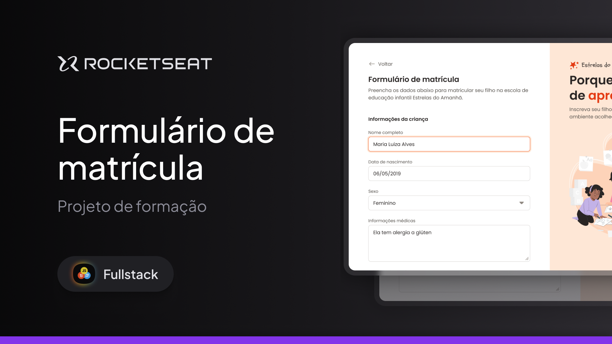

<h1 align="center"> Full-Stack </h1>

 

  

## 🚀 Tecnologias

Esse projeto foi desenvolvido com as seguintes tecnologias:

- HTML e CSS
- Git e Github
- Figma

## 💻 Projeto
Um formulário de matrícula escolar!
- [Para ver no site](https://lupyeah.github.io/Formulario-de-matricula/)

## 📋 Funcionalidades

- 📌 Uma página com formulários de matrícula escolar
- ❗ Conseguir cadastrar informações da criança
- 🌞 Escolher o turno entre manhã e tarde
- ⛹️‍♀️ Conseguir escolher uma atividade
- 📌 Conseguir anexar arquivos
---

Feito pela Lupy com ajuda da Rocketseat -> [Participe da nossa comunidade!](https://discord.gg/rocketseat)
